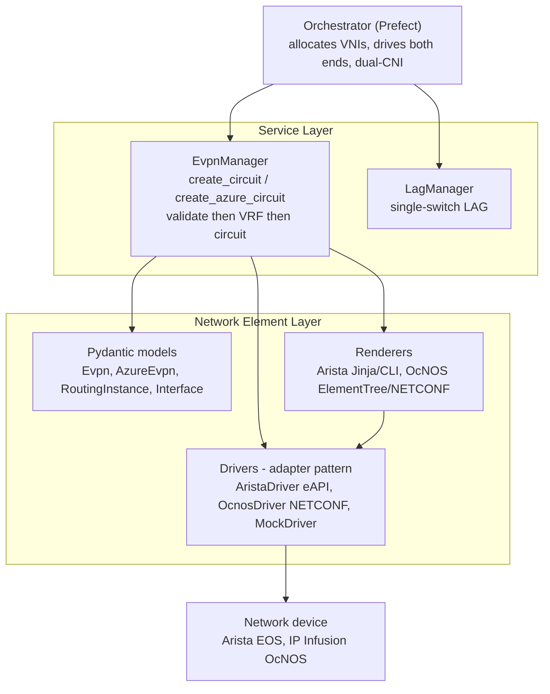
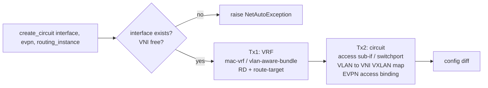
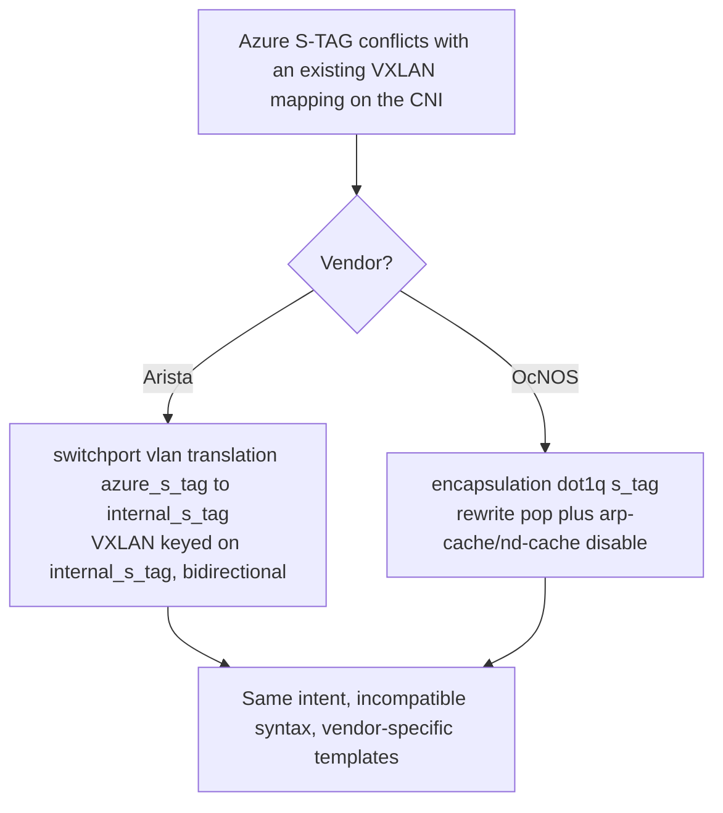

# EVPN Service — Architecture & Design Decisions

A distilled view of the EVPN circuit building blocks in `netauto`: the high-level
architecture, the decisions that shaped it, and the key flows as diagrams.

This is a condensed, implementation-aligned summary of the full ACXv2 specification
(`mermaid/acxv2_logic_documentation.md`) and its reference config templates
(`mermaid/acxv2_templates/`). Where this document and the original spec differ, this
document reflects **what is actually built**; the differences are called out under
[Decisions](#decisions).

---

## Scope

This library builds the **per-service EVPN circuit between ports** — not the EVPN
underlay. The underlay (BGP, the L2VPN-EVPN address family, the VXLAN VTEP source)
is assumed pre-configured on each device.

| Area | In scope | Deferred / out of scope |
|------|----------|--------------------------|
| Products | `cloud_vc` (customer ↔ CNI), `p2p_vc` (member ↔ member), `azure` (Q-in-Q) | Other cloud providers (AWS/GCP/Oracle/Alibaba/Huawei — same VPWS shape as `cloud_vc`) |
| Topology | **Global transport** (endpoints on different devices → EVPN/VXLAN) | **Local switching** (same device → pure L2, no VXLAN) |
| Ports | Single ports; single-switch LAG (via `LagManager`) | MLAG provisioning |
| Layers | Layer 2 only | Layer 3 (BGP/routing/IPs) — owned by the customer |

---

## High-level architecture

The system follows a layered model (RFC 8309), separating the **service** from the
**network element**. It is a *building-blocks library*: each call configures **one
endpoint on one device**. Multi-device orchestration (stitching the two ends of a
circuit, dual-CNI, VNI allocation) is owned by the orchestrator (Prefect).

- **Models** (`models.py`) — Pydantic schemas loosely based on YANG (`Evpn`,
  `AzureEvpn`, `RoutingInstance`, `Interface`/`Lag`).
- **Renderers** (`render/`) — turn a model into device config: Arista via Jinja2
  CLI templates, OcNOS via ElementTree → NETCONF `edit-config` XML.
- **Drivers** (`drivers/`) — an adapter per platform: `AristaDriver` (pyeapi/eAPI),
  `OcnosDriver` (ncclient/NETCONF), `MockDriver` (offline/testing).
- **Service layer** (`evpn.py`, `logic.py`) — `EvpnManager` reads device state,
  validates, renders, and pushes; `LagManager` is the equivalent for LAGs.

---

## Service model

A circuit connects two **endpoints**. The library configures each endpoint
independently; the products differ only in what each endpoint looks like.

| Product | Endpoints | Per-endpoint config |
|---------|-----------|---------------------|
| `p2p_vc` | member A ↔ member B | Single VLAN → VNI; identical on both sides |
| `cloud_vc` | customer ↔ CNI | Single VLAN → VNI; identical on both sides |
| `azure` | customer ↔ CNI (dual CNI) | Q-in-Q: S-TAG + 1–3 C-TAGs; customer ≠ CNI |

For non-Azure products, the customer and CNI endpoints render **identically** — the
customer/CNI (and p2p A/B) labels are purely descriptive. They only diverge for Azure.

Each endpoint is built as **two device transactions**:

Two separate transactions (VRF first) because: on OcNOS the `mac-vrf` must exist
before the circuit references it, and on Arista a fresh config session avoids CLI
sub-mode leaking between the two blocks (a bare `vlan <id>` after a
`vlan-aware-bundle` block is otherwise swallowed as a bundle member).

---

## Decisions

The decisions that shaped the implementation, including where it deliberately
departs from the ACXv2 spec.

### 1. Global transport only (local switching deferred)
The spec splits every service into **local switching** (both ports on the same
device → plain L2 VLAN, no VXLAN) vs **global transport** (different devices →
EVPN/VXLAN). Only the global path is implemented; local switching is deferred.

### 2. VNI is allocated externally and used verbatim
The spec concatenates the VLAN onto the VNI for some products (e.g. `vni 5000` +
`vlan 100` → `5000100`). **This was rejected.** VNIs are allocated sequentially and
tracked by a process *outside* this library (which reads current network state via
`netauto`), then passed in whole on `Evpn.vni` / `AzureEvpn.vni`. The library uses
the VNI verbatim for the VXLAN id / vpn-id and the mac-vrf / vlan-aware-bundle name —
never derived from the VLAN. As a result `cloud_vc` and `p2p_vc` render identically
given the same vni/vlan, and `service_type` is a descriptive label only.

### 3. Per-device building blocks; orchestrator owns the rest
One call = one endpoint on one device. The orchestrator allocates VNIs, calls the
building block once per end, and (for Azure) repeats the CNI config on the secondary
CNI with its own VNI. This keeps the library stateless and single-responsibility.

### 4. Vendor differences are real and incompatible
Arista and OcNOS model L2 and tag manipulation differently. Templates are
vendor-specific and never mixed.

| | Arista EOS | IP Infusion OcNOS |
|---|---|---|
| Southbound | eAPI (CLI) | NETCONF (XML) |
| L2 model | switchport on a trunk + global VLANs | dot1q **sub-interfaces** |
| Add S-TAG (Q-in-Q) | `switchport vlan translation <ctag> dot1q-tunnel <s_tag>` | `rewrite push dot1q <s_tag>` |
| S-TAG conflict fix | `switchport vlan translation <azure> <internal>` (bidirectional) | `rewrite pop` + arp/nd-cache disable |
| VLAN reuse | VLAN mapped to a VNI is globally reserved on the device | VLANs can be reused across sub-interfaces |

### 5. Layer 2 only
The building blocks provision L2 (VLANs, sub-interfaces, the VLAN↔VNI mapping, the
EVPN access binding). The customer owns Layer 3 (BGP peering, routing, addressing).

### 6. RD / route-target convention
RD and route-target come from the `RoutingInstance` model (caller-supplied). The
reference templates use `<asn>:<service-number>` for the RD and a Teraco prefix for
the route-target: **`37195`** for standard services and **`37186`** for Azure.

---

## Azure ExpressRoute (Q-in-Q)

Azure presents customer traffic as **1–3 inner C-TAGs wrapped in one outer S-TAG**
(802.1ad). It mandates **dual CNI** (primary + secondary). Each circuit gets its own
VNI; the orchestrator drives the two CNIs.

- **Customer port** — tunnels each C-TAG into the S-TAG, then maps the S-TAG to the VNI.
- **CNI port** — keys on the S-TAG (the C-TAGs are encapsulated inside the VXLAN tunnel).
- **S-TAG rewrite** — when Azure's S-TAG already collides with a VXLAN mapping on a
  CNI device, the conflict is resolved per-vendor (Arista translates to an internal
  S-TAG; OcNOS pops the S-TAG). The CNI vendor pair is always matched.

The model (`AzureEvpn`) carries: `s_tag`, `c_tags` (1–3, customer side), `role`
(`customer`/`cni`), `rewrite` (CNI conflict resolution), and `internal_s_tag`
(Arista rewrite only). It is driven via `EvpnManager.create_azure_circuit` /
`delete_azure_circuit`.

> **Lab note:** the cEOSLab virtual platform does **not** support
> `switchport ... dot1q-tunnel` (no Q-in-Q hardware), so the Arista *customer* path
> cannot be exercised on the lab — it is valid on real EOS hardware. The Arista
> CNI-rewrite path (plain `switchport vlan translation`) and both OcNOS paths are
> live-validated.

---

## Implementation map

| Concern | Where |
|---------|-------|
| Service layer | `src/netauto/evpn.py` (`EvpnManager`), `src/netauto/logic.py` (`LagManager`) |
| Models | `src/netauto/models.py` (`Evpn`, `AzureEvpn`, `RoutingInstance`, `Interface`/`Lag`) |
| Arista renderer | `src/netauto/render/arista.py` + `templates/arista_eos/*.j2` |
| OcNOS renderer | `src/netauto/render/ocnos.py` (ElementTree → NETCONF) |
| Drivers | `src/netauto/drivers/` (`arista.py`, `ocnos.py`, `mock.py`) |
| Reviewable config matrix | `validation_output/` (generated by `scripts/generate_evpn_validation.py`) |
| Tests | `tests/` — render, manager, golden matrix; live: `tests/test_live_devices.py` (`RUN_LIVE_TESTS=1`) |

---

## References

- **Full spec (verbose):** `mermaid/acxv2_logic_documentation.md`
- **Reference config templates:** `mermaid/acxv2_templates/`
- **Original detailed diagrams:** `mermaid/acxv2_overview_diagram.mermaid`,
  `acxv2_vni_vlan_flow.mermaid`, `acxv2_vendor_translation.mermaid`,
  `acxv2_template_logic.mermaid`
- **Repo architecture overview:** `system_architecture.md`
- **Lab devices:** `lab_devices.md`
