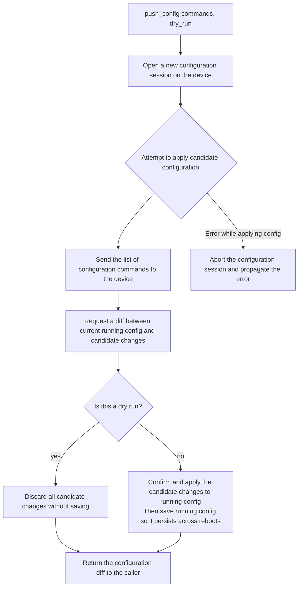

Arista push_config Flowchart

```mermaid
flowchart TD
    A[push_config commands, dry_run] --> B[Open a new configuration session on the device]
    B --> C{Attempt to apply candidate configuration}
    C --> D[Send the list of configuration commands to the device]
    D --> E[Request a diff between current running config and candidate changes]
    C -->|Error while applying config| F[Abort the configuration session and propagate the error]

    E --> G{Is this a dry run?}
    G -->|yes| H[Discard all candidate changes without saving]
    G -->|no| I[Confirm and apply the candidate changes to running config\nThen save running config so it persists across reboots]

    H --> J[Return the configuration diff to the caller]
    I --> J[Return the configuration diff to the caller]
```

