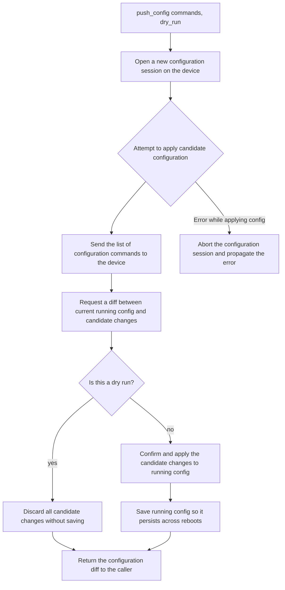
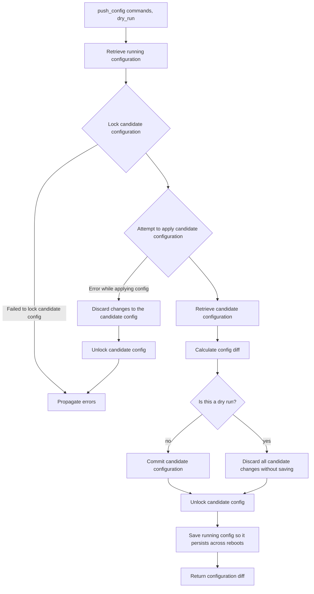

### Arista push_config flowchart

```mermaid
flowchart TD
    A[push_config commands, dry_run] --> B[Open a new configuration session on the device]
    B --> C{Attempt to apply candidate configuration}
    C --> D[Send the list of configuration commands to the device]
    D --> E[Request a diff between current running config and candidate changes]
    C -->|Error while applying config| F[Abort the configuration session and propagate the error]

    E --> G{Is this a dry run?}
    G -->|yes| H[Discard all candidate changes without saving]
    G -->|no| I[Confirm and apply the candidate changes to running config]
    I --> K[Save running config so it persists across reboots]

    H --> J[Return the configuration diff to the caller]
    K --> J[Return the configuration diff to the caller]
```

### OCNOS push_config flowchart

```mermaid
flowchart TD
    A[push_config commands, dry_run] --> B[Retrieve running configuration]
    B --> C{Lock candidate configuration}
    C --> D{Attempt to apply candidate configuration}    
    C --> |Failed to lock candidate config| H
    
    D -->|Error while applying config| F[Discard changes to the candidate config]
    F --> G[Unlock candidate config]
    G --> H[Propagate errors]

    D --> N[Retrieve candidate configuration]
    N --> R[Calculate config diff]

    R --> I{Is this a dry run?}
    I -->|yes| J[Discard all candidate changes without saving]
    I -->|no| K[Commit candidate configuration]
    K --> M[Unlock candidate config]
    M --> U[Save running config so it persists across reboots]
    U --> O[Return configuration diff]
    J --> M
```
